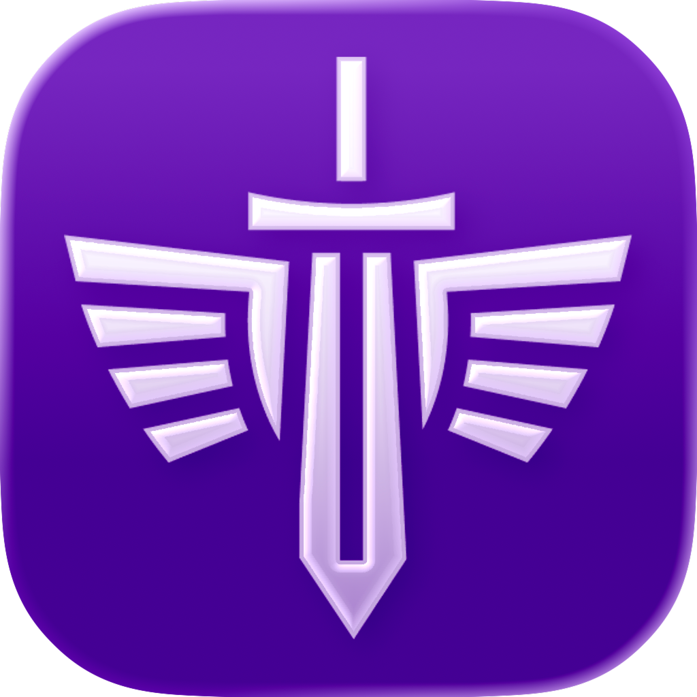

# GLTF Studio

<p align="center">
  
</p>

A native macOS application for optimizing glTF and GLB 3D models using [gltfpack](https://github.com/zeux/meshoptimizer/tree/master/gltf).

## Features

- 🚀 **Fast Optimization** - Native macOS app with gltfpack integration
- 🎨 **Texture Compression** - ETC1S and UASTC formats with quality control
- 📦 **Mesh Optimization** - Vertex quantization and mesh compression
- 📊 **Real-time Stats** - See file size reduction and processing time
- 🎯 **Presets** - Low, Balanced, and High quality presets
- 🛠️ **Custom Settings** - Fine-tune every optimization parameter
- 📂 **Drag & Drop** - Simple file selection with drag and drop support

## Download

### Option 1: Pre-built Release (Recommended)

**Download from GitHub Releases:**

1. Go to [Releases](https://github.com/pannonianknight/GLTF-Studio/releases)
2. Download the latest `GLTFStudio.zip`
3. Extract the zip file
4. Right-click `GLTFStudio.app` → Open (first time only due to Gatekeeper)
5. Drag to `/Applications` to install

**Alternative:** Download `GLTFStudio.zip` directly from the [Release](Release/) folder in the repository.

**Note:** The app is code-signed but not notarized. On first launch, you'll need to right-click → Open.

### Option 2: Build from Source

**Requirements:**
- macOS 14.0 or later
- Xcode 15.0 or later
- gltfpack binary (see [Building](#building))

## Building

### Quick Build

Use the provided build script:

```bash
cd GLTFStudio
./build_release.sh
```

The app will be built to `Release/GLTFStudio.app` and a ZIP archive will be created.

### Manual Build

1. **Clone the repository:**
```bash
git clone https://github.com/pannonianknight/GLTF-Studio.git
cd GLTF-Studio/GLTFStudio/GLTFStudio
```

2. **Build gltfpack binary:**
```bash
cd ~/Desktop
git clone https://github.com/zeux/meshoptimizer
git clone -b gltfpack https://github.com/zeux/basis_universal

cd meshoptimizer
cmake . -DMESHOPT_BUILD_GLTFPACK=ON \
        -DMESHOPT_GLTFPACK_BASISU_PATH=../basis_universal \
        -DCMAKE_BUILD_TYPE=Release \
        -DCMAKE_OSX_ARCHITECTURES="arm64;x86_64"

cmake --build . --target gltfpack --config Release
```

3. **Copy gltfpack to project:**
```bash
cp gltfpack /path/to/GLTFStudio/Resources/Binaries/
chmod +x /path/to/GLTFStudio/Resources/Binaries/gltfpack
```

4. **Open and build in Xcode:**
```bash
open GLTFStudio.xcodeproj
# Product → Build (⌘B)
```

## Usage

1. **Launch GLTFStudio**
2. **Select input file:**
   - Drag & drop a `.glb` or `.gltf` file
   - Or click "Choose File"
3. **Choose preset:**
   - **Low Quality** - Maximum compression (~10-20% of original)
   - **Balanced** - Recommended for most use cases (~30-40% of original)
   - **High Quality** - Minimal quality loss (~50-70% of original)
   - **Custom** - Fine-tune all settings
4. **Choose output location** (optional)
5. **Click "Optimize"**

## Optimization Settings

### Texture Compression

- **Format:**
  - **ETC1S** - Best compression ratio, good for mobile
  - **UASTC** - Higher quality, larger files, good for desktop
  - **None** - Keep original textures
- **Quality:** 1-255 (lower = more compression)
- **Max Dimension:** Downscale textures to max size
- **Power-of-Two:** Force power-of-two dimensions (required for older GPUs)

### Mesh Optimization

- **Compression:** Enable mesh compression
- **Vertex Position:** 8-16 bits (higher = better quality)
- **Texture Coordinates:** 8-16 bits (UV precision)
- **Normals:** 8-16 bits (lighting precision)

## System Requirements

- **macOS:** 14.0 (Sonoma) or later
- **Architecture:** Universal (Apple Silicon & Intel)
- **Disk Space:** ~10 MB

## File Structure

```
GLTFStudio/
├── GLTFStudio.xcodeproj      # Xcode project
├── GLTFStudioApp.swift        # Main app entry
├── Models/                    # Data models
├── Views/                     # SwiftUI views
├── Services/                  # Business logic
│   ├── GLTFPackService.swift  # gltfpack wrapper
│   ├── GLTFParser.swift       # glTF parsing
│   ├── ProcessRunner.swift    # Process execution
│   └── FileService.swift      # File operations
├── Resources/
│   ├── Binaries/
│   │   └── gltfpack           # gltfpack binary (not in git)
│   ├── Icons/                 # App icons
│   ├── Licenses/              # Third-party licenses
│   └── Presets/               # Optimization presets
├── Release/                   # Build output
│   ├── GLTFStudio.app         # Built application
│   └── GLTFStudio.zip         # Distribution archive
└── build_release.sh           # Build script
```

## Technical Details

- **Language:** Swift 5.9
- **UI Framework:** SwiftUI
- **Minimum Deployment:** macOS 14.0
- **Architectures:** arm64 (Apple Silicon), x86_64 (Intel)
- **Sandboxing:** Enabled with file access entitlements

## Troubleshooting

### "GLTFStudio can't be opened because it is from an unidentified developer"

Right-click the app → Open (first time only)

### "gltfpack binary not found"

Make sure `gltfpack` is included in `Resources/Binaries/` and is executable:
```bash
chmod +x Resources/Binaries/gltfpack
```

### Build fails with "Operation not permitted"

The build script uses a custom derived data path. If issues persist, try building directly in Xcode.

## Contributing

Contributions are welcome! Please feel free to submit issues or pull requests.

## License

Copyright © 2025 Marko Fuček

This project is licensed under the MIT License - see the LICENSE file for details.

### Third-Party Licenses

- **gltfpack/meshoptimizer** - MIT License (see `Resources/Licenses/meshoptimizer-LICENSE.txt`)
- **basis_universal** - Apache 2.0 License (see `Resources/Licenses/basis_universal-LICENSE.txt`)

## Credits

- **gltfpack** by [Arseny Kapoulkine](https://github.com/zeux)
- **meshoptimizer** - [GitHub](https://github.com/zeux/meshoptimizer)
- **Basis Universal** - [GitHub](https://github.com/BinomialLLC/basis_universal)

## Author

**Marko Fuček**  
GitHub: [@pannonianknight](https://github.com/pannonianknight)

---

Made with ❤️ for the 3D community

